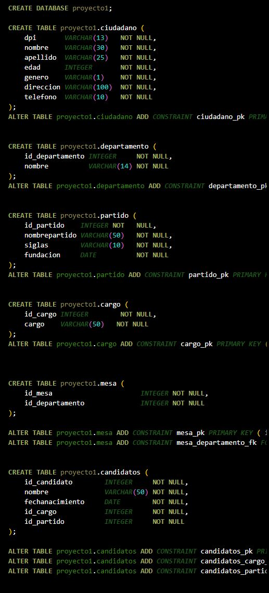

# UNIVERSIDAD DE SAN CARLOS DE GUATEMALA
## FACULTAD DE INGENIERIA
## LABORATORIO DE BASES DE DATOS 1
## SECCION A
## Aux. Edin Emanuel Montenegro Vasquez

# 🌟 PROYECTO 1 🌟

| NOMBRE | CARNE |
|--------|-------|
| Kemel Josue Efrain Ruano Jeronimo | 202006373|

# INTRODUCCION

### Las bases de datos son una parte fundamental de la tecnología de la información en la actualidad. Se han convertido en una herramienta esencial para el almacenamiento, gestión y recuperación de datos en una amplia variedad de aplicaciones y sistemas. Desde las redes sociales hasta los sistemas bancarios, las bases de datos son el corazón que impulsa la mayoría de las aplicaciones informáticas modernas. Una base de datos se puede entender como un conjunto organizado de datos relacionados entre sí. Estos datos pueden ser números, texto, imágenes, sonidos o cualquier otro tipo de información que se desee almacenar y administrar. La importancia de las bases de datos radica en su capacidad para estructurar los datos de manera que sean fáciles de almacenar, consultar y actualizar.

# OBJETIVOS
* Creacion de un Modelo de datos.
* Aprender a realizar los tipos de modelos vistos en laboratorio.
* Uso de Mysql para consultas.
* Aprender lenguaje SQL &nbsp;

# REQUISITOS DEL SISTEMA
* Windows 10,8,7 (x86 y x64).
* Procesador a 1.6 GHz o superior.
* 1 GB (32 bits) o 2 GB (64 bits) de RAM (agregue 512 MB al host si se 
* ejecuta en una máquina virtual).
* 3 GB de espacio disponible en el disco duro.
* Disco duro de 5400 RPM.
* Tarjeta de vídeo compatible con DirectX 9 con resolución de pantalla de 1024 x 768 o más.

# Modelos
### se creo un modelo de bases de datos el cual se uso la herramienta data modeler. 
- Modelo Conceptual. 
   
  En este modelo se realiza una presentacion abstracta y simplificada de la estructura de datos y las relaciones en la base de datos .
>>
- Modelo Logico , Este debe de llevar 3 componentes importantes los cuales son:
    - Entidades
    - Relaciones
    - Atributos

    
   Se uso la herramienta de oracle data modeler para la realizacion de este modelo , en este podemos tabular el diseño conceptual , aca vemos las formas de normalizacion.
>>
- Modelo Relacional , en este modelo se mostrara el modelo logico ya mas detallado con las llaves primarias y  foraneas asi como la relacion que tenga una con otra .
 

## Modelo Fisico 
### En este modelo se realizo la implementacion ya una base de datos real en este caso se utilizo Mysql.
- Esta es una captura muy corta para demostrar la implemetacion del modelo.

## Creacion de Base de datos
### para la creacion de la base de datos se utilizo Flask un  framework  para la peticiones hacia la base de datos, asi tambien como Mysql para la base de datos a crear y Imnsomnia para interactuar con la api que envia solicitudes y muestra los resultados devueltos por esta .

### A continuacion se explicara paso por paso para crear la base de datos en Mysql usando el lenguaje de SQL.

- Paso 1
    - **CREATE DATABASE proyecto1**   , aca crear una nueva base de datos en la cual puede ser cualquier nombre que se quiera dar a la base de datos.

- paso 2
    - **CREATE TABLE proyecto1.ciudadano ( &nbsp;**

            dpi       VARCHAR(13)   NOT NULL,&nbsp;

            nombre    VARCHAR(30)   NOT NULL,&nbsp;

            apellido  VARCHAR(25)   NOT NULL,&nbsp;

            edad      INTEGER       NOT NULL,&nbsp;

            genero    VARCHAR(1)    NOT NULL,&nbsp;

            direccion VARCHAR(100)  NOT NULL,&nbsp;
            
            telefono  VARCHAR(10)   NOT NULL  
        **);** &nbsp;&nbsp;&nbsp;
        Se utiliza el comando CREATE TABLE para crear una nueva tabla , lleva un nombre pero estaba tabla debe esta dentro de la base de datos que se creo puede usar el comando **USE [ nombre de la base de datos]**
        o puede ser como en el ejemplo **[nombre de la base de datos].[nombre de la tabla]**
        En Mysql exiten diferentes tipo para los atributos para string esta **VARCHAR** para enteros esta **INTEGER** se pone la clausula **NOT NULL** para indicar que este atributo no puede ser nulo .
    
- paso 3
    - aca se muestra un ejemplo de como realizar una consulta.&nbsp;

            SELECT &nbsp;

            P.nombre AS PRESIDENTE,&nbsp;

            V.nombre AS VICEPRESIDENTE,&nbsp;

            PR.siglas AS PARTIDO&nbsp;

            FROM proyecto1.candidatos P  &nbsp;

            INNER  JOIN proyecto1.candidatos V ON P.id_partido = V.id_partido AND P.id_cargo = 1 AND V.id_cargo = 2 &nbsp;
            
            INNER JOIN proyecto1.partido PR ON P.id_partido = PR.id_partido;
        Se utiliza el comando **SELECT** para decir que se seleccionara un atributo **FROM** le decimos de que tabla se selecciona el atributo en este caso *candidatos* 